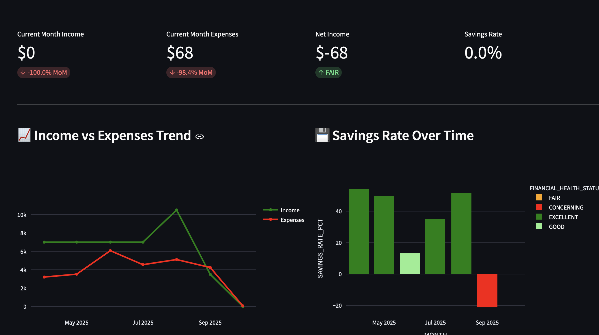
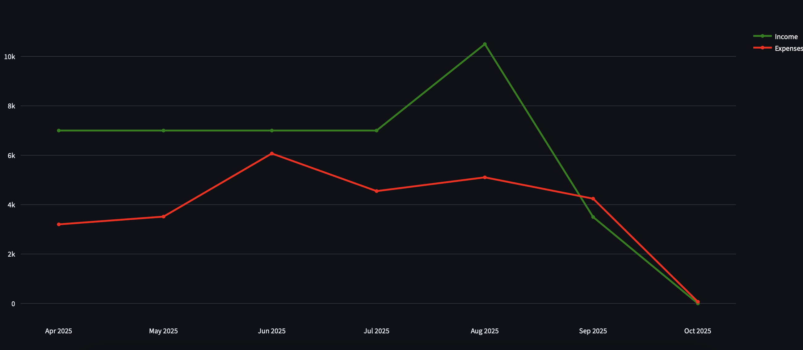
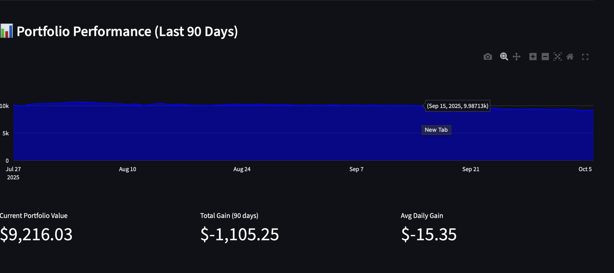

# Personal Finance Analytics Pipeline
A complete analytics engineering project demonstrating modern data pipeline practice with dbt, Snowflake, and automated orchestration.

## Project Overview
This project transforms raw financial, stock portfolio, and weather data into actionable insights through a fully automated data pipeline.

## Dashboard Preview
<p align="center">
  
  <br/>
  <em>Interactive dashboard showing key financial metrics and trends</em>
</p>

### Key Visualizations

<table>
  <tr>
    <td width="50%">
    
    <br/>
    <em>Income vs Expenses and Savings Rate Trends</em>
    </td>
   <td width="50%">
    
    <br/>
    <em>Portfolio performance and weather impact analysis</em>
    </td>
  </tr>
</table>

## Architecture

- **Data Sources**: Transaction data, stock portfolio, weather data
- **Transformation**: dbt models (staging -> marts)
- **Warehouse**: Snowflake
- **Orchestration**: GitHub Actions (daily automated runs at 6 AM UTC)
- **Visualization**: Streamlit dashboard

## Running the Project

### Set up
```bash
#install dependencies
pip install dbt-snowflake streamlit snowflake-connector-python plotly python-dotenv
# configure dbt profile in ~/.dbt/profiles.yml
```

### Generate Mock Data
```bash
cd personal_finance_analysis/scripts
python generate_transaction_data.py
python generate_stock_data.py
python generate_weather_data.py
```

### Upload Data to Snowflake
Upload the generated CSV files to Snowflake:
- `data/transactions.csv` -> `RAW_TRANSACTIONS`
- `data/stock_data.csv` -> `RAW_STOCK_DATA`
- `data/weather_data.csv` -> `RAW_WEATHER_DATA`

### Run dbt Models
```bash
cd personal_finance_analytics
dbt deps
dbt run
dbt test
```

### Launch Dashboard
```bash
cd dashboard
streamlit run app.py
```

The dashboard will open in your browser at `http://localhost:8501`

## Testing
Tests are included and run locally:
```bash
dbt test
```

**Note**: Tests are disabled in CI/CD due to a Snowflake connection pooling issue with GitHub Actions runners, but work perfectly in local development.

